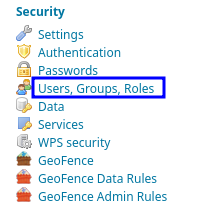
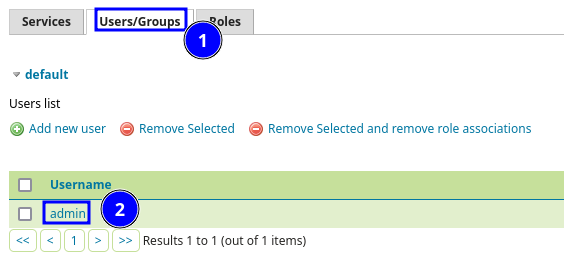
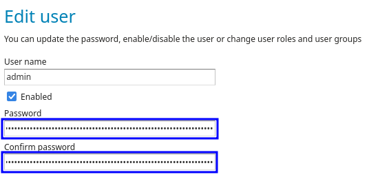

# Installazione Geonode

La presente guida segue i passi e le indicazioni della [documentazione ufficiale](https://docs.geonode.org/en/master/install/basic/index.html).

## Installazione delle dipendenze

Le seguenti dipendenze sono necessarie:

* docker
* docker-compose
* python-venv

Queste possono essere installate su Debian con il comando:

```bash
apt install docker.io docker-compose python3.10-venv
```

## Preparazione di Geonode

È necessario clonare il repository github di Geonode, con il comando:

```bash
git clone https://github.com/GeoNode/geonode-project.git -b 4.1.x
```

Dopodiché è possibile attivare il virtual environment, ed installare la versione richiesta di Django

```bash
python3 -m venv ./.venvs/geonodefull
source ./.venvs/geonodefull/bin/activate
pip install Django==3.2.13
```

Possiamo poi generare il progetto Django, in una nuova cartella “geonodefull”:

```bash
django-admin startproject --template=./geonode-project -e py,sh,md,rst,json,yml,ini,env,sample,properties -n monitoring-cron -n Dockerfile geonodefull
```

E generare il file .env di partenza, specificando il dominio (sottodominio.esempio.tld), la mail dell’utente admin (mail@esempio.tld, utilizzata per la richiesta del certificato ssl), il tipo di ambiente (prod), e l’abilitazione dell’https:

:::{attention}
Questo passaggio assume che il dominio `sottodominio.esempio.tld` sia valido, punti al server su cui viene installato geonode, e che quest'ultimo sia raggiungibile dall'esterno.

In caso contrario, omettere le direttive `--https`, `--env_type`, `--hostname` e `--mail` per configurare Geonode senza https.
:::

```bash
python3 geonodefull/create-envfile.py --https --env_type prod --hostname sottodominio.esempio.tld --email mail@esempio.tld
```

Possiamo quindi entrare nella nuova cartella, generare le immagini di docker, ed avviare i processi, con i comandi seguenti. Questa fase richiederà un po’ di tempo.

```bash
cd geonodefull
docker-compose build
docker-compose up -d
```

Quando tutti i container sono correttamente avviati, geonode dovrebbe essere attivo sul dominio specificato, in https.

## Modifica della password di Geoserver

L’istanza di Geonode così avviata restituirà un errore in fase di caricamento dei file. Questo accade poiché la generazione del file env genera una password di Geoserver, che non viene correttamente impostata all’interno dello stesso. Vedi anche:

* [https://github.com/GeoNode/geonode/issues/8024](https://github.com/GeoNode/geonode/issues/8024)
* [https://github.com/GeoNode/geonode/issues/11570](https://github.com/GeoNode/geonode/issues/11570)

È quindi necessario:

1. Recuperare, nel file env, la password generata per Geoserver, alla riga “GEOSERVER_ADMIN_PASSWORD”
2. Collegarsi alla pagina di Geoserver, all’indirizzo [https://dominio.scelto.tld/geoserver](https://dominio.scelto.tld/geoserver) (ad esempio, [https://sottodominio.esempio.tld/geoserver](https://sottodominio.esempio.tld/geoserver)
3. Accedere con le credenziali di default: user=admin password=geoserver
4. Cliccare su “Users, Groups, Roles” nella sezione “Security”



5. Cliccare su “Users/Groups”, “admin”



6. Inserire negli appositi campi la password recuperata al punto 1



7. Cliccare su “Save”, in fondo alla pagina

## Configurazione mail

Per configurare la mail, è necessario modificare il file .env, nell’apposita sezione, ed abilitare le seguenti opzioni, sostituendo server, username e password:

```unixconfig
EMAIL_ENABLE=True
DJANGO_EMAIL_BACKEND=django.core.mail.backends.smtp.EmailBackend
DJANGO_EMAIL_HOST=smtp.server.tld
DJANGO_EMAIL_PORT=587
DJANGO_EMAIL_HOST_USER=smtp_user@server.tld
DJANGO_EMAIL_HOST_PASSWORD="Password_corretta"
DJANGO_EMAIL_USE_TLS=True
DEFAULT_FROM_EMAIL='user_geonode@server.tld'
```

:::{attention}
Questo passaggio assume che il server `smtp.server.tld` utilizzi TLS sulla porta 587.

In caso contrario, modificare le opzioni `DJANGO_EMAIL_USE_TLS` e `DJANGO_EMAIL_PORT` di conseguenza.
:::

In particolare:

* `DJANGO_EMAIL_HOST` rappresenta il nome, o l'indirizzo IP, del server smtp da utilizzare
* `DJANGO_EMAIL_PORT` rappresenta la porta da utilizzare per la connessione
* `DJANGO_EMAIL_HOST_USER` rappresenta il nome utente da utilizzare per l'autenticazione
* `DJANGO_EMAIL_HOST_PASSWORD` rappresenta la password da utilizzare per l'autenticazione
* `DJANGO_EMAIL_USE_TLS` indica se utilizzare la crittazione TNS
* `DEFAULT_FROM_EMAIL` indica l'indirizzo email dal quale verranno inviati i messaggi

Dopodiché, ricreare i container con

```bash
docker-compose up -d
```

## Registrazione utenti

Per consentire la registrazione degli utenti, modificare nel file .env le seguenti opzioni

```unixconfig
ACCOUNT_OPEN_SIGNUP=True
ACCOUNT_EMAIL_REQUIRED=True
```

Dopodiché, ricreare i container con

```bash
docker-compose up -d
```

## Configurazione Recaptcha

Per configurare il Recaptcha Google alla registrazione, inserire le seguenti righe nel file .env, inserendo le chiavi corrette (versione v2):

```unixconfig
RECAPTCHA_ENABLED=True
RECAPTCHA_PUBLIC_KEY=*******************************************
RECAPTCHA_PRIVATE_KEY=*******************************************
```

Dopodiché, ricreare i container con

```bash
docker-compose up -d
```

## Chiusura porte

I container comunicano tra loro tramite la rete interna di Docker, ed il container di Geonode comunica con l’esterno. È quindi possibile commentare, all’interno del file docker-compose.yml, tutte le porte salvo quelle di Geonode. Riportiamo di seguito un estratto del file yml, nel quale sarà necessario commentare le porte non richieste.

Porte Geonode aperte:

```yaml
  geonode:
    image: geonode/nginx:1.23.3
    build: ./docker/nginx/
    container_name: nginx4${COMPOSE_PROJECT_NAME}
    environment:
      - HTTPS_HOST=${HTTPS_HOST}
      - HTTP_HOST=${HTTP_HOST}
      - HTTPS_PORT=${HTTPS_PORT}
      - HTTP_PORT=${HTTP_PORT}
      - LETSENCRYPT_MODE=${LETSENCRYPT_MODE}
      - HTTP_SCHEME=${HTTP_SCHEME}
      - HTTP_PROXY_NAME=${HTTP_PROXY_NAME}
      - RESOLVER=127.0.0.11
    ports:
      - "${HTTP_PORT}:80"
      - "${HTTPS_PORT}:443"
```

Porte di Geoserver chiuse (commentate):

```yaml
  geoserver:
    image: geonode/geoserver:2.23.0
    build: ./docker/geoserver/
    container_name: geoserver4${COMPOSE_PROJECT_NAME}
    healthcheck:
      test: "curl --fail --silent --write-out 'HTTP CODE : %{http_code}\n' --output /dev/null http://127.0.0.1:8080/geoserver/ows"
      start_period: 60s
      interval: 60s
      timeout: 10s
      retries: 10
    env_file:
      - .env
    # ports:
      # - "8080:8080"
```

Porte di jenkins chiuse (commentate):

```yaml
  jenkins:
    image: jenkins/jenkins:2.164-jdk11
    container_name: jenkins4${COMPOSE_PROJECT_NAME}
    user: jenkins
    # ports:
      # - '${JENKINS_HTTP_PORT}:${JENKINS_HTTP_PORT}'
      # - '${JENKINS_HTTPS_PORT}:${JENKINS_HTTPS_PORT}'
      # - '50000:50000'
    # network_mode: "host"
```

Dopo aver commentato le porte, ricreare i container con

```bash
docker-compose up -d
```

## Risoluzione problemi

Nel caso in cui la pagina di Geoserver presentasse alcuni elementi in http semplice, verificare le configurazioni presenti a [questa pagina](https://docs.geonode.org/en/master/install/advanced/core/index.html#install-and-enable-https-secured-connection-through-the-let-s-encrypt-provider).
